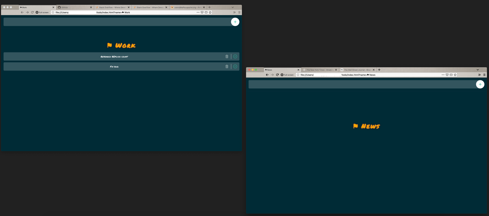

# "Marker" tab with the ability to make a To-do list
A simple marker tab for people who keep many tabs and windows open in their browser but want to know where things are. It has a bonus feature of being able make quick to-do lists. List items can also be links.

## What is a marker tab?
If you have many tabs open but would like to place a dummy tab with a custom message to help you stay organized, then this is what you need! Of course there are other fancy browser plugins but this is plain HTML + JavaScript + CSS and it does not need access to any of your open tabs.

## Usage
1. Download (or clone) this repo and open [todo/index.html](todo/index.html) in your browser
1. Customize the tab by providing a name like `index.html?name=⚑ News`. If you make notes, it will stay in your local browser storage and survive restarts
1. You can go one step further and create a custom search engine if your browser supports it. For example on Chrome you could [create a custom search engine](https://www.ghacks.net/2018/03/30/custom-search-engines-in-google-chrome/) to `index.html?name=⚑ %s` and add a keyword like `tab`. You can then open a new marker tab by just typing `tab Blah` in the adderess bar and it will magically open this page for you
Add to-do list items. They can also be links if they are written like this [Refer SO](http://stackoverflow.com/foo-bar)

# Alternative / Standalone / Simple

If you don't need most of the functionality of the [index.html](index.html) feature you can download just this file and use [standalone-tab.html](standalone-tab.html). 

## Usage
 * Open the file and provide a custom title like this `standalone-tab.html?title=😃` or any title you need
 * You can open this file in as many tabs and windows as you need with different titles
 * This also dynamically creates a Favicon so you can tell which tab is which

# Disclaimer
This has been cobbled together from a variety of sources to fit my somewhat specific needs:
 * [Max Sandelin's To-do](https://github.com/themaxsandelin/todo)
 * StackOverflow snippets

I'm not a Web developer so the code style and quality is probably mediocre at best.

# License
[MIT](LICENSE.md)
